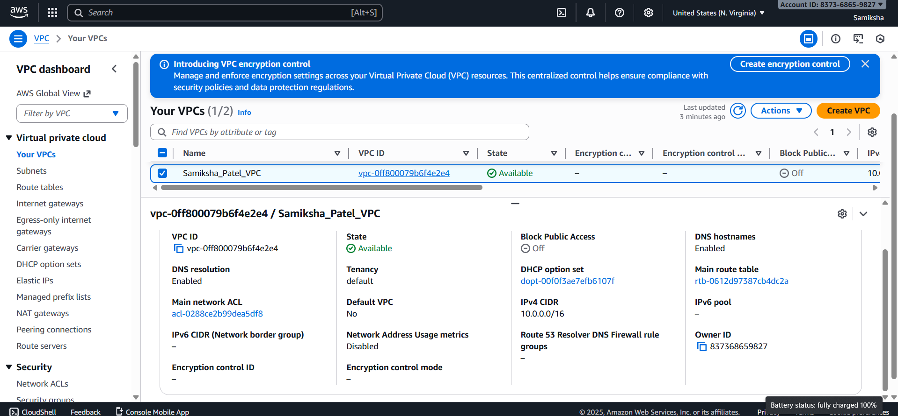
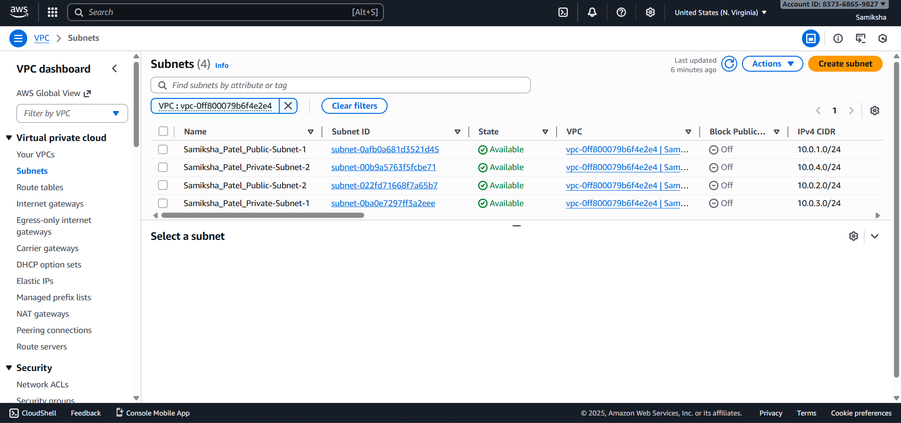
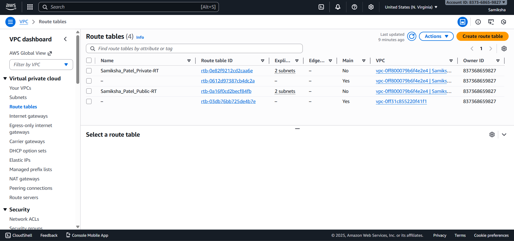
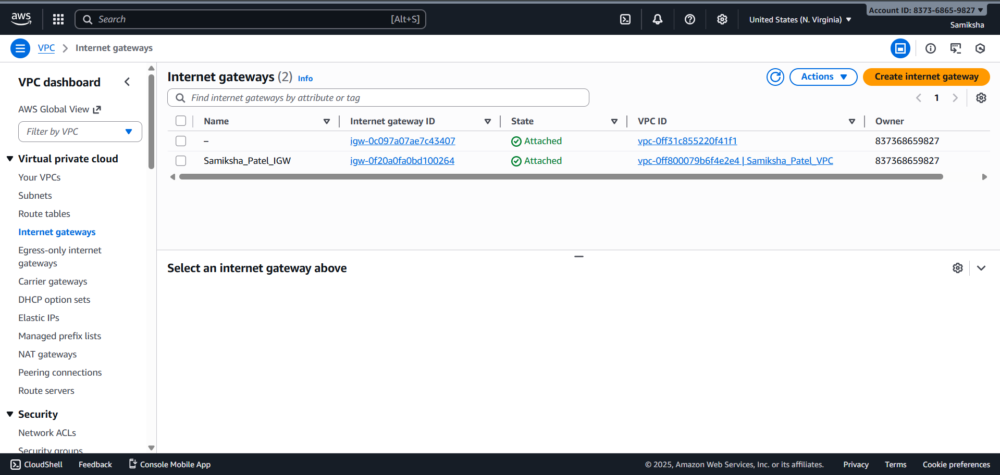
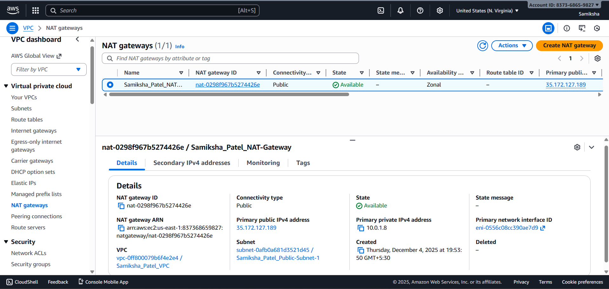

# Task 1: VPC Networking Setup

## Design Explanation

### Network Architecture:
- **VPC CIDR**: `10.0.0.0/16` - Provides 65,536 IP addresses for scalability
- **Public Subnet 1**: `10.0.1.0/24` in us-east-1a (for resources needing internet access)
- **Public Subnet 2**: `10.0.2.0/24` in us-east-1b (for high availability)
- **Private Subnet 1**: `10.0.3.0/24` in us-east-1a (for backend servers)
- **Private Subnet 2**: `10.0.4.0/24` in us-east-1b (for database layer)

### Why These CIDR Ranges:
1. **10.0.0.0/16**: Large enough for future expansion while following AWS best practices
2. **Sequential /24 blocks**: Easy to manage and remember (10.0.1.x, 10.0.2.x, etc.)
3. **Clear separation**: Public (10.0.1.x, 10.0.2.x) and Private (10.0.3.x, 10.0.4.x) ranges are distinct
4. **Multi-AZ deployment**: Subnets in different AZs ensure high availability

### Components Created:
1. **VPC** with DNS support enabled
2. **2 Public Subnets** with auto-assign public IP enabled
3. **2 Private Subnets** for internal resources
4. **Internet Gateway** for public internet access
5. **NAT Gateway** with Elastic IP for private subnet outbound access
6. **Public Route Table** with route to Internet Gateway
7. **Private Route Table** with route to NAT Gateway

## Screenshots

### 1. VPC


### 2. Subnets (4 created: 2 public, 2 private)


### 3. Route Tables


### 4. Internet Gateway


### 5. NAT Gateway


## Terraform Code Structure
The infrastructure is defined in `main.tf` with:
- Proper tagging using `Samiksha_Patel_` prefix
- Outputs for VPC and subnet IDs
- Dependencies between resources
- Clean separation of public and private networking

## How to Deploy
```bash
cd task1-vpc
terraform init
terraform plan
terraform apply
