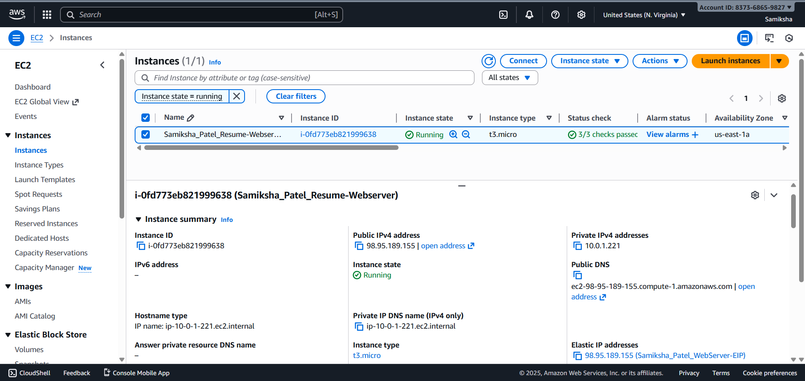
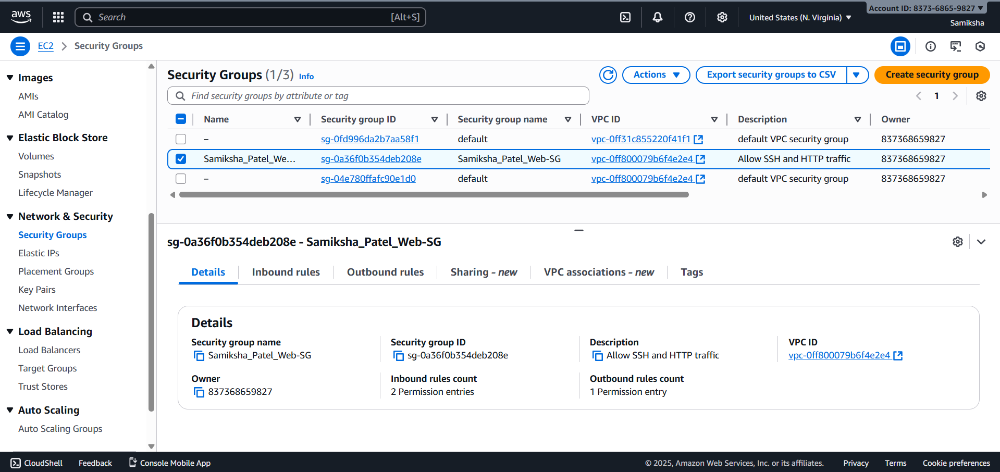

# Task 2: EC2 Static Website Hosting

## Implementation Details

### EC2 Instance Configuration:
- **AMI**: Amazon Linux 2023 (ami-0b0dcb5067f052a63)
- **Instance Type**: t3.micro (Free Tier eligible)
- **Subnet**: Public Subnet 1 from Task 1 VPC
- **Security Group**: Allows SSH (22) and HTTP (80) from anywhere
- **Storage**: 8 GB GP2 encrypted root volume

### Nginx Installation & Configuration:
- Installed via `amazon-linux-extras install nginx1`
- Auto-start on boot enabled
- Custom resume HTML page created at `/usr/share/nginx/html/index.html`
- Health check page at `/health.html`

### Security Hardening Applied:
- Security Group restricts access to only necessary ports
- Root volume encryption enabled
- Instance termination protection considered
- Minimal inbound rules (SSH + HTTP only)

### Website Details:
- Accessible via: http://98.95.189.155
- Static HTML resume with professional styling
- Responsive design with CSS
- Includes skills, experience, and certifications sections

## Screenshots

### 1. EC2 Instance


### 2. Security Group


### 3. Website in Browser


## Terraform Commands Used
```bash
terraform init
terraform plan
terraform apply
