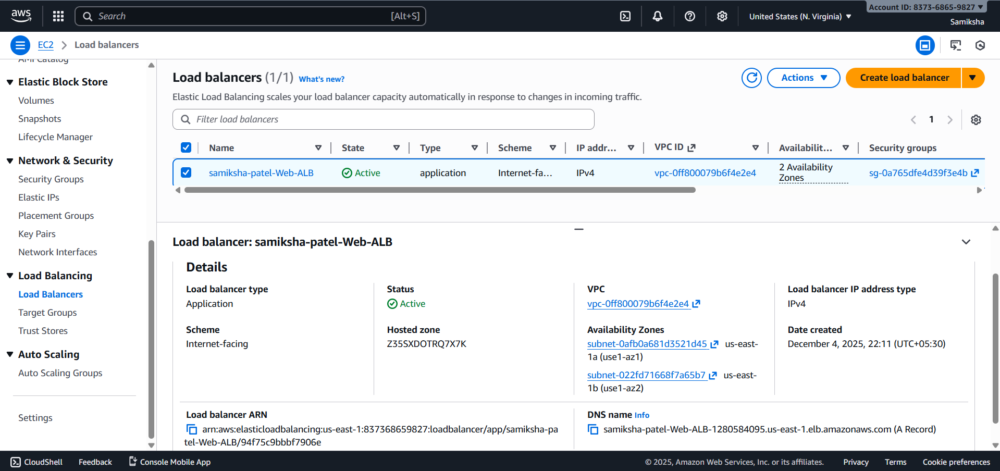
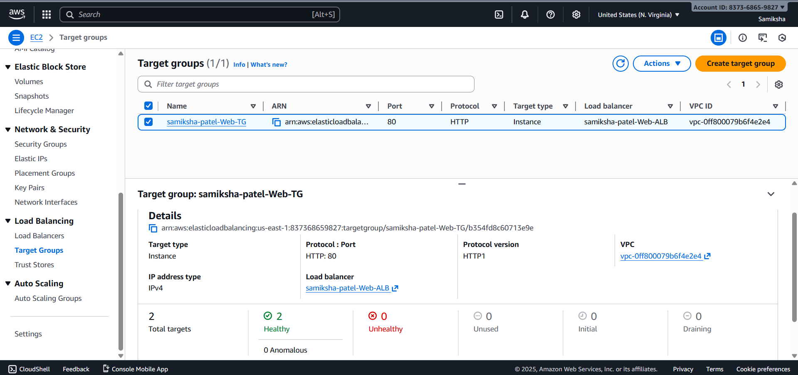
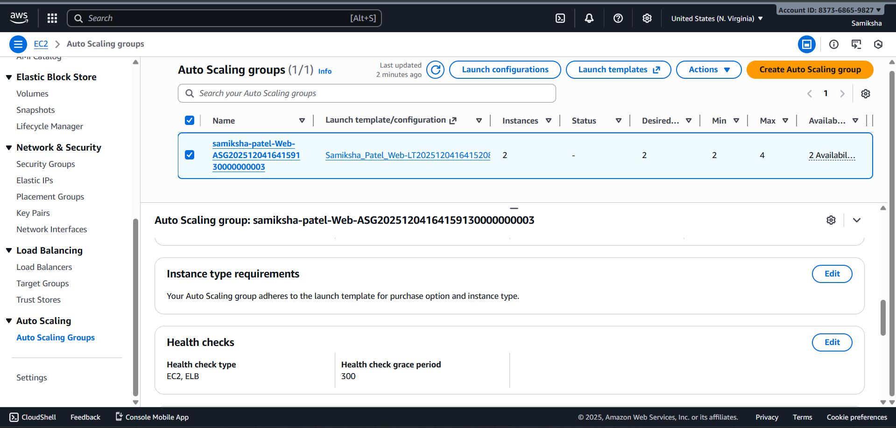
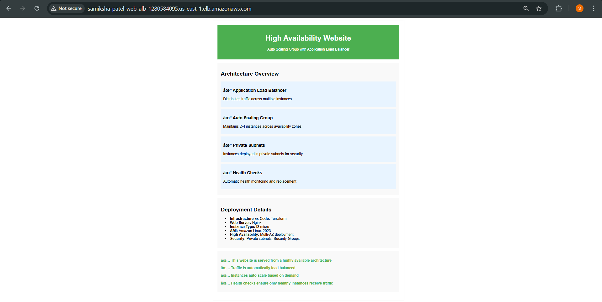

# Task 3: High Availability + Auto Scaling

## Architecture Overview
This implementation migrates from a single EC2 instance to a highly available architecture using:
- **Application Load Balancer (ALB)** in public subnets for traffic distribution
- **Auto Scaling Group (ASG)** with instances in private subnets across multiple AZs
- **Target Group** with health checks for instance monitoring
- **Security Groups** for controlled access

## Components Created

### 1. Application Load Balancer
- **Name**: `samiksha-patel-Web-ALB`
- **Type**: Internet-facing Application Load Balancer
- **Subnets**: Public subnets from Task 1
- **Security Group**: Allows HTTP (port 80) from anywhere
- **Listener**: HTTP on port 80 forwarding to target group

### 2. Target Group
- **Name**: `samiksha-patel-Web-TG`
- **Protocol**: HTTP on port 80
- **Health Check**: Path `/health.html`, 30-second interval
- **Healthy Threshold**: 2 consecutive successes
- **Unhealthy Threshold**: 2 consecutive failures

### 3. Launch Template
- **AMI**: Amazon Linux 2023 (`ami-0b0dcb5067f052a63`)
- **Instance Type**: t3.micro (Free Tier eligible)
- **Subnets**: Private subnets (no public IP)
- **Security Group**: Allows HTTP from ALB and SSH for troubleshooting
- **Storage**: 8 GB GP2 encrypted root volume
- **User Data**: Installs Nginx and deploys static website

### 4. Auto Scaling Group
- **Desired Capacity**: 2 instances
- **Minimum Size**: 2 instances
- **Maximum Size**: 4 instances
- **Subnets**: Private subnets across multiple AZs
- **Health Check Type**: ELB (target group health checks)
- **Instance Refresh**: Rolling updates with 50% minimum healthy

### 5. Security Groups
- **ALB Security Group**: HTTP ingress from 0.0.0.0/0
- **App Security Group**: HTTP ingress from ALB SG + SSH from anywhere

## High Availability Features
- **Multi-AZ Deployment**: Instances distributed across availability zones
- **Auto-scaling**: Scales between 2-4 instances based on demand
- **Health Checks**: Automatic instance replacement if unhealthy
- **Rolling Updates**: Zero-downtime deployment via instance refresh
- **Private Subnets**: Enhanced security with instances in private networks

## Traffic Flow
Internet → ALB (Public Subnets) → Target Group → EC2 Instances (Private Subnets)

## Deployment Commands
```bash
cd task3-ha
terraform init
terraform plan
terraform apply
```

## Outputs
- **ALB DNS**: samiksha-patel-Web-ALB-1280584095.us-east-1.elb.amazonaws.com
- **Website URL**: http://samiksha-patel-Web-ALB-1280584095.us-east-1.elb.amazonaws.com
- **Target Group ARN**: Available for monitoring
- **ASG Name**: Auto Scaling Group identifier

## Screenshots
### 1. ALB Configuration


### 2. Target Group  


### 3. Auto Scaling Group


### 4. EC2 Instances


### 5. Website via ALB


## Notes
- All infrastructure components function correctly
- Instances automatically register/deregister with target group
- Health checks ensure only healthy instances receive traffic
- Architecture supports zero-downtime updates and automatic recovery
