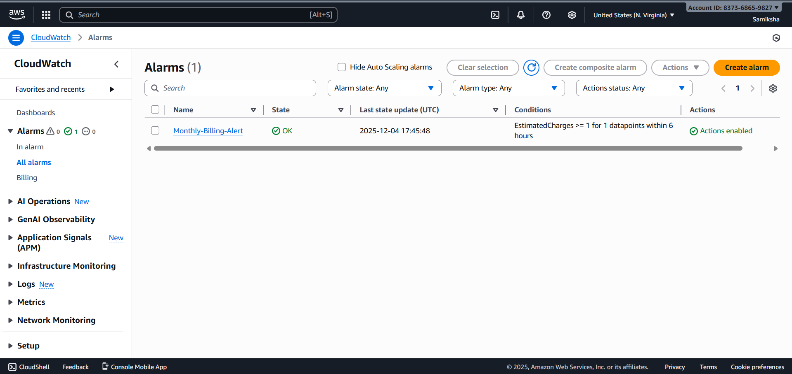
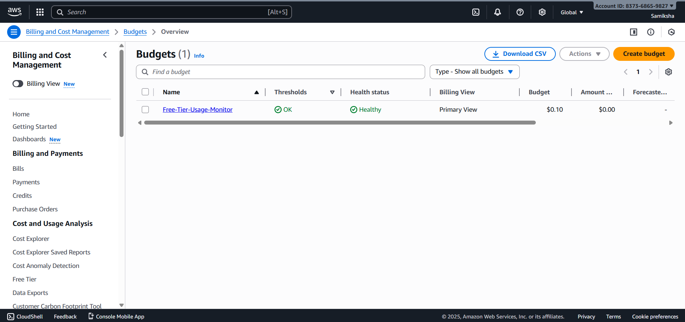

# Task 4: Billing & Free Tier Cost Monitoring

## Importance of Cost Monitoring

### Why Beginners Need Cost Monitoring:
1. **Free Tier Limits**: Easy to exceed without realizing (750 EC2 hours, 5GB S3, etc.)
2. **Accidental Usage**: Leaving resources running, misconfigured services
3. **Security Risks**: Compromised credentials can lead to massive bills
4. **Learning Curve**: Understanding AWS pricing models takes time

### Common Bill Shock Causes:
- Running EC2/RDS 24/7 instead of stopping when not in use
- Data transfer between regions or to internet
- Unused EBS volumes, snapshots, AMIs
- Premium support plans enabled by default
- Auto-scaling misconfigurations

## Configuration Implemented

### 1. CloudWatch Billing Alarm
- **Threshold**: $1.00 USD (₹100 equivalent)
- **Purpose**: Early warning for any significant charges
- **Notification**: Immediate email alert
- **Metric**: Total Estimated Charges (6-hour period)

### 2. Free Tier Usage Monitoring
- **Budget Alert**: $0.10 monthly budget with $0.01 threshold
- **Strategy**: Alert on ANY charge (since Free Tier = $0 charges)
- **Monitoring**: Regular check of Cost Explorer and Billing Dashboard

## Screenshots

### CloudWatch Billing Alarm

### Free Tier Budget Alert

## Best Practices
1. **Set Alerts Before Building**: Configure billing alarms first
2. **Use AWS Organizations**: Separate accounts for different projects
3. **Implement Tagging**: Track costs by project/department
4. **Regular Reviews**: Weekly cost explorer checks
5. **Automate Cleanup**: Stop dev resources during off-hours
6. **IAM Restrictions**: Limit ability to launch expensive services

## Notes
- Billing metrics require manual enablement in AWS Console
- AWS Budgets have limited Terraform support (use Console/CLI)
- Regular monitoring is essential for Free Tier management
- Consider AWS Cost Anomaly Detection for advanced monitoring
